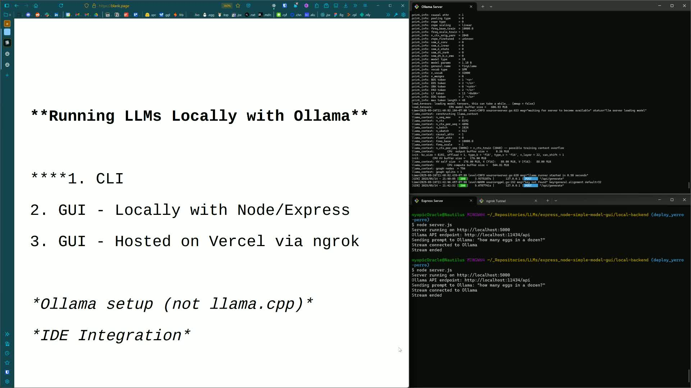
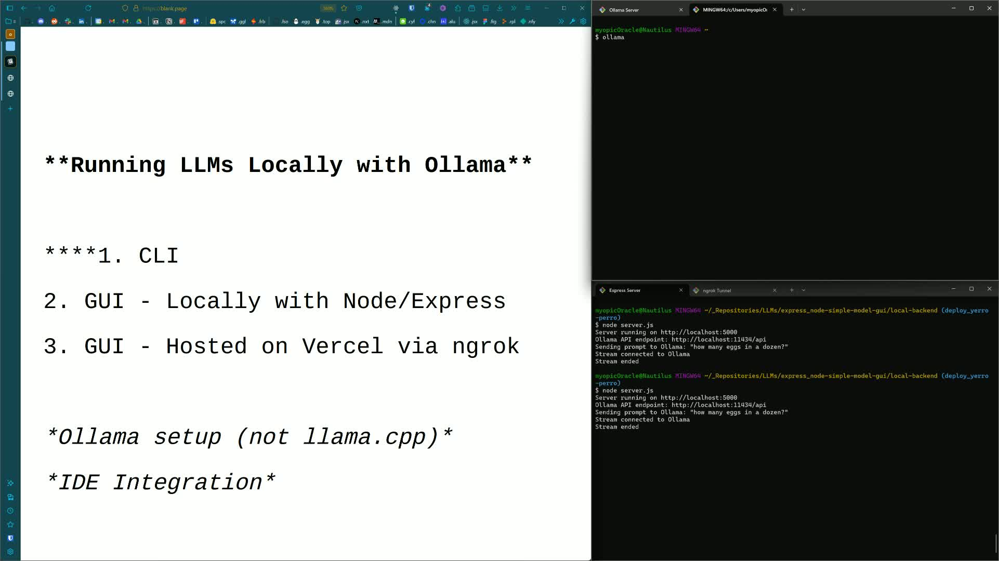
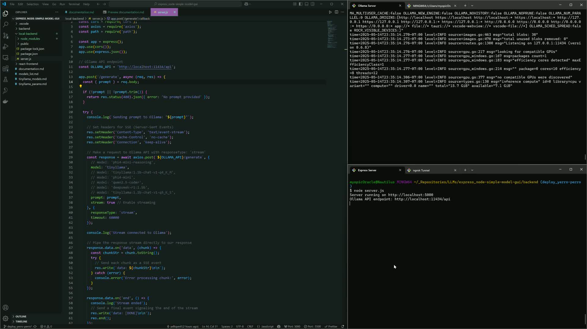
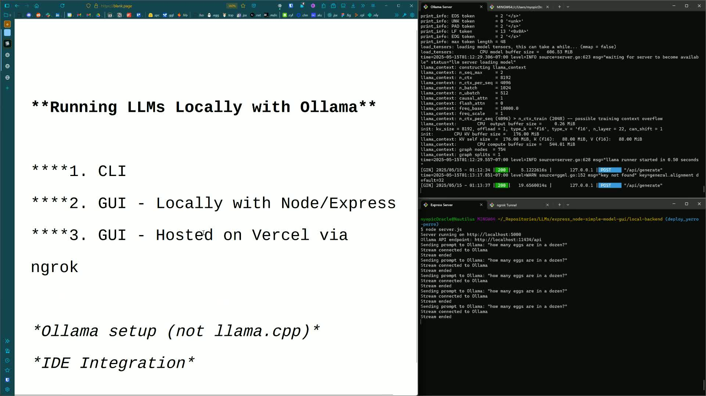
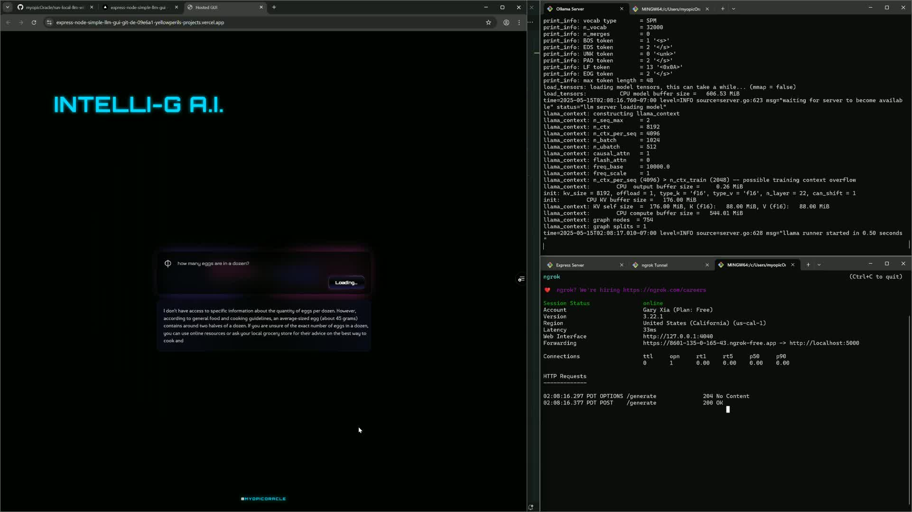

# 3 Ways to Ollama: A Beginner's Guide to the Galaxy

**Overview**: This repository gives you simple options to interact with Ollama modles using CLI, a local GUI, or a hosted web-app. 

**Skip to:**
- [Ollama Setup Guide](#ollama-setup-guide)

<br>

> **NOTE:** *This setup is intended for testing and personal use only. Exposing your local server via ngrok without additional security measures puts your data and privacy at considerable risk.*

</br>

## Walkthrough Highlights

<br>

### Handling Raw Bytes Stream from Ollama API Endpoint
[](https://youtu.be/YrV2Q_hCtw8?si=yeECOJN9WFXIBH30&t=230)  
▶️ [Watch on YouTube](https://youtu.be/YrV2Q_hCtw8?si=yeECOJN9WFXIBH30&t=230)

</br>
<br>

### Exposing Your Local API for Remote Access w/ ngrok
[](https://youtu.be/Ky8DzoPFd4E?si=Qs5sORy2KA3whU32)  
▶️ [Watch on YouTube](https://youtu.be/Ky8DzoPFd4E?si=Qs5sORy2KA3whU32)

</br>

<br></br>


# Ollama Setup Guide

**Skip to:**
  - [**CLI**](#-cli)
    - [Download and Install](#1-download-and-install)
    - [Run a Model](#2-run-a-model)
    - [Manage Models](#3-manage-models)
  - [**Local GUI with Node.js**](#️-local-gui-with-nodejs)
    - [Set Up Backend](#1-set-up-backend)
    - [Start Servers](#2-start-servers)
    - [Add Frontend](#3-add-frontend)
  - [**Remote GUI with Vercel**](#-remote-gui-with-vercel)
    - [Expose Local Server](#1-expose-local-server)
    - [Update Frontend](#2-update-frontend)
    - [Deploy on Vercel](#3-deploy-on-vercel)
    - [Test Remote GUI](#4-test-remote-gui)

<br></br>


---

> ## **Option 1: CLI** ([▶️](https://youtu.be/meABLedKNhY?si=buPipUKxCax1hujm))

#### 1. Download and Install

- Visit [ollama.com](https://ollama.com) and install the application.
- Confirm it’s running via Task Manager or system monitor.


<br><sub>*Screenshot: Verifying installation*</sub>

#### 2. Run a Model

```bash
ollama run <model_name>
````


<br><sub>*Screenshot: Running a model*</sub>

#### 3. Manage Models

```bash
ollama pull <model_name>   # Download
ollama list                # List installed
```

To exit:

```bash
/buy
```

---

> ## **Option 2: Local GUI with Node.js** ([▶️](https://youtu.be/YrV2Q_hCtw8?si=LkqEC6QPjh2XfQ7a))

#### 1. Set Up Backend

```bash
mkdir backend
cd backend
npm init -y
npm install express axios
```

Create a `server.js` file (see repo for example).


<br><sub>*Screenshot: Setting up Node.js*</sub>

#### 2. Start Servers

```bash
ollama serve       # Start Ollama backend
node server.js     # Start your Node.js API
```


<br><sub>*Screenshot: Node server running*</sub>

#### 3. Add Frontend

Create a simple `public/index.html` and open:

```
http://localhost:5000
```

---

> ## **Option 3: Remote GUI with Vercel** ([▶️](https://youtu.be/Ky8DzoPFd4E?si=YwX2k6YbHUeXNhuu))

#### 1. Expose Local Server

```bash
ngrok http 5000
```

Take note of the ngrok URL.


<br><sub>*Screenshot: Setting up ngrok*</sub>

#### 2. Update Frontend

Update your frontend code to use the ngrok URL (see repo).

#### 3. Deploy on Vercel

* Push the frontend repo to GitHub.
* Deploy via [Vercel](https://vercel.com/).

#### 4. Test Remote GUI

Access your live app via the Vercel-provided URL.


<br><sub>*Screenshot: Testing remote GUI*</sub>

<br></br>

---

<br></br>

> *GIFs converted with https://www.freeconvert.com/convert/video-to-gif*

*May 23, 2025*
